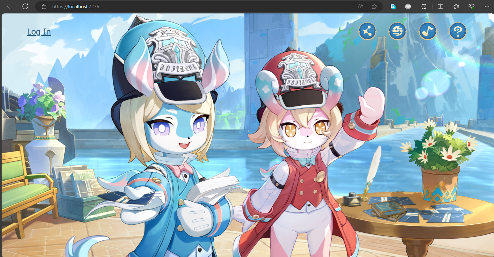
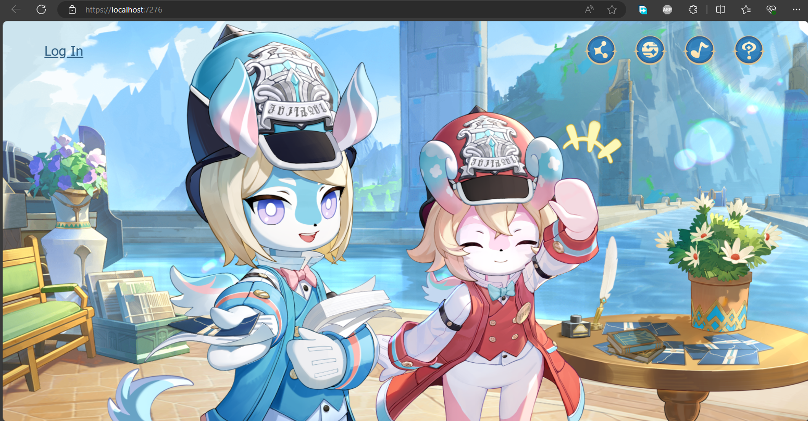
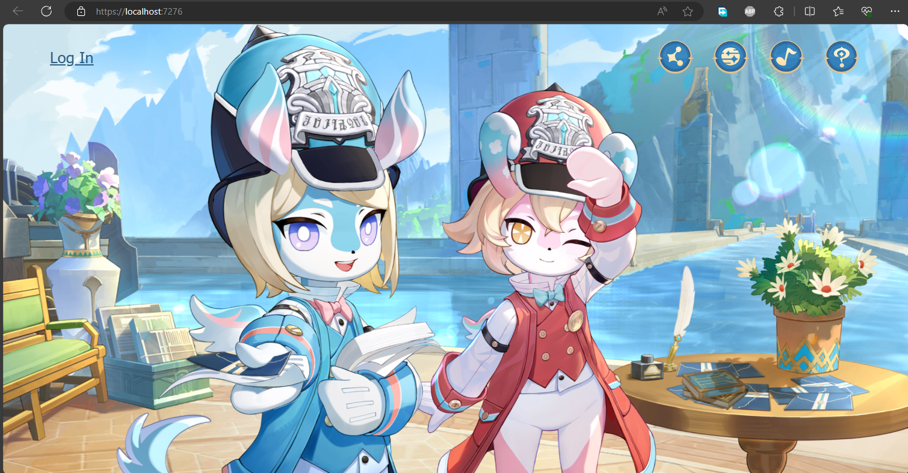
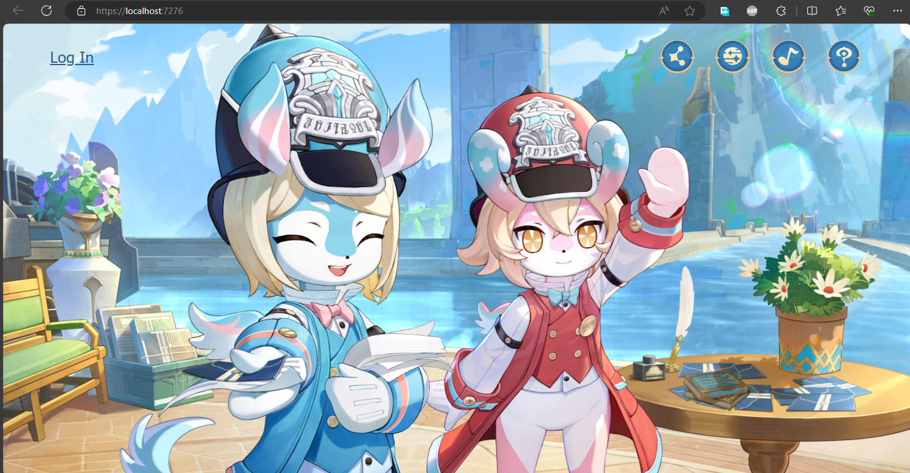
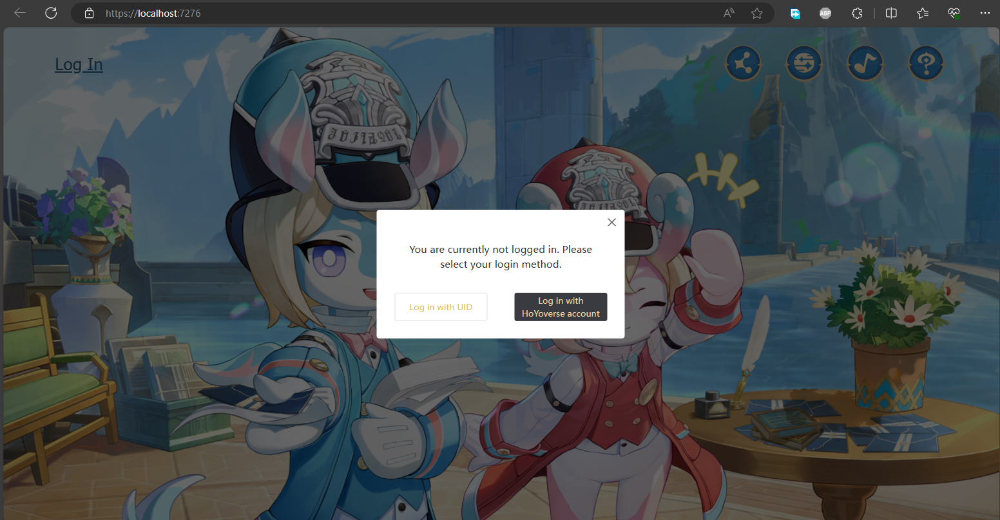
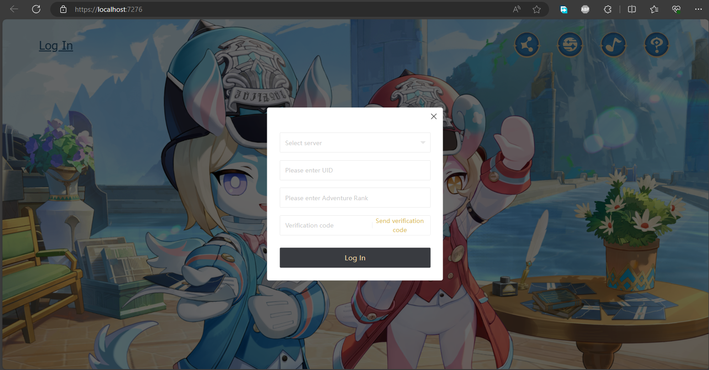
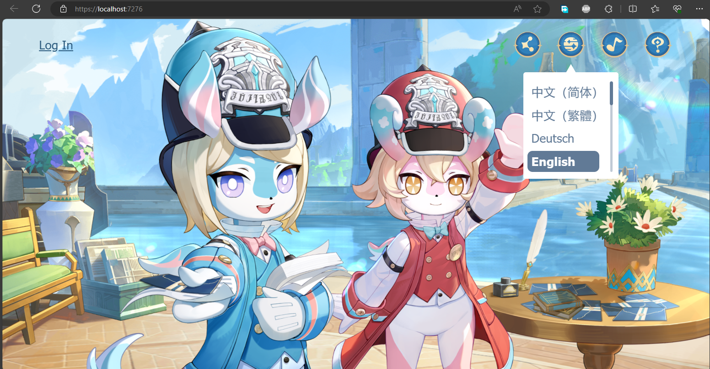
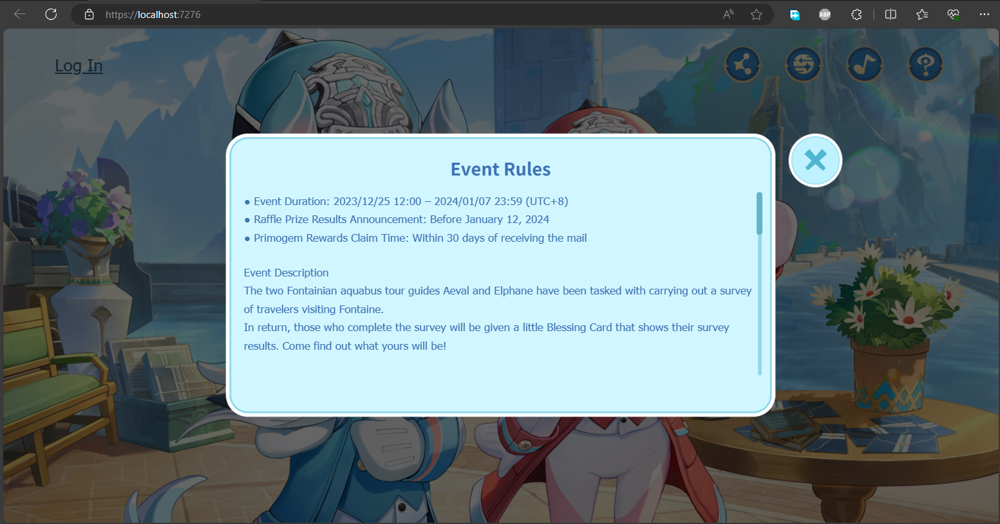

# Melusine's Survey (Genshin Impact)
This is a partially working self-hosted Genshin Impact's web event ["Melusines' Survey"](https://act.hoyoverse.com/ys/event/e20231225melusine-questionnaire/index.html?game_biz=hk4e_global&hyl_presentation_style=fullscreen&hyl_auth_required=true&hyl_landscape=true&hyl_hide_status_bar=true&utm_source=launcher&utm_medium=banner). Well, [Ms. Aeval](https://genshin-impact.fandom.com/wiki/Aeval) and [Ms. Elphane](https://genshin-impact.fandom.com/wiki/Elphane)'s animation sure works!
## Sreenshots

## Insights from This Event's JavaScripts
* This web event uses Vue. It is possible that Hoyoverse also use Vue for their other web events.
* This web event has development, test, prerelease, and production environments. It is possible that their other web events also have these environments.
* Oversea and CN hosts are different.
* Hoyoverse still refers themself as miHoYo in CN region.
* Hoyoverse uses isSea or IS_SEA flag to differentiate between overseas and CN players.